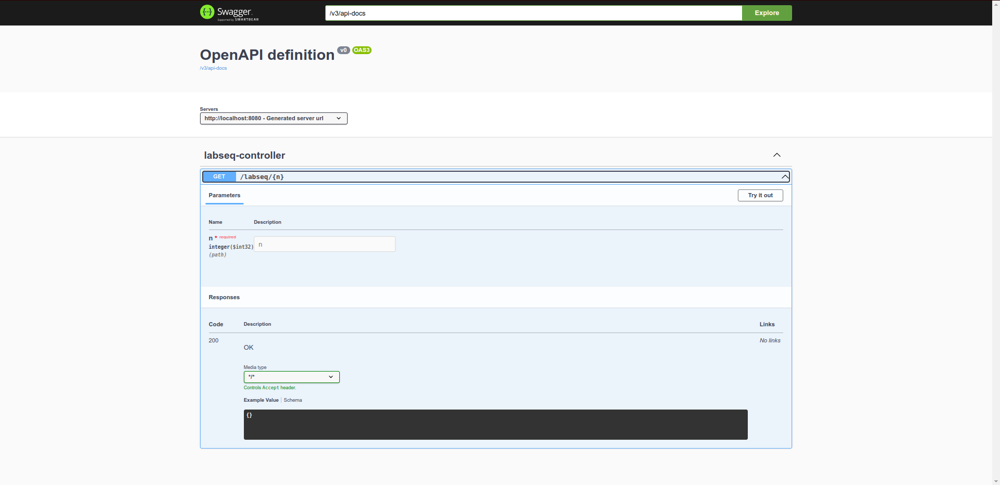

# Labseq Spring Boot Application Setup Guide

## Prerequisites

- **Docker**: Ensure Docker is installed and running on your machine. You can download it from [Docker's official website](https://www.docker.com/get-started).
- **Maven**: Ensure Maven is installed. You can download it from [Maven's official website](https://maven.apache.org/download.cgi).
- **Java**: Ensure Java 17 is installed on your machine. You can download it from [AdoptOpenJDK](https://adoptopenjdk.net/).

## Step-by-Step Guide to Launch Spring Boot Application

### Step 1: Clone the Repository

First, clone the GitHub repository to your local machine.

### Step 2: Build the Project

Navigate to the project directory and build the project using Maven. This will compile the project and run tests.


```sh
mvn clean package
```

### Step 3: Build the Docker Image
Use the Spring Boot Maven plugin to build a Docker image. This command will package the application into a Docker image using the Paketo buildpacks.

```sh
mvn spring-boot:build-image
```

### Step 4: Run the Docker Container
Run the Docker container using the Docker image built in the previous step.

```sh
docker run -p 8080:8080 docker.io/library/labseq:0.0.1-SNAPSHOT
```

### Step 5: Access the Application
Open your web browser and navigate to the following URL to access the application:

- **Application Endpoint:** http://localhost:8080

### Step 6: Access the Swagger UI
To access the Swagger UI for API documentation, navigate to the following URL in your web browser:

- **Swagger UI:** http://localhost:8080/swagger-ui.html
##### This is what it will look like:
